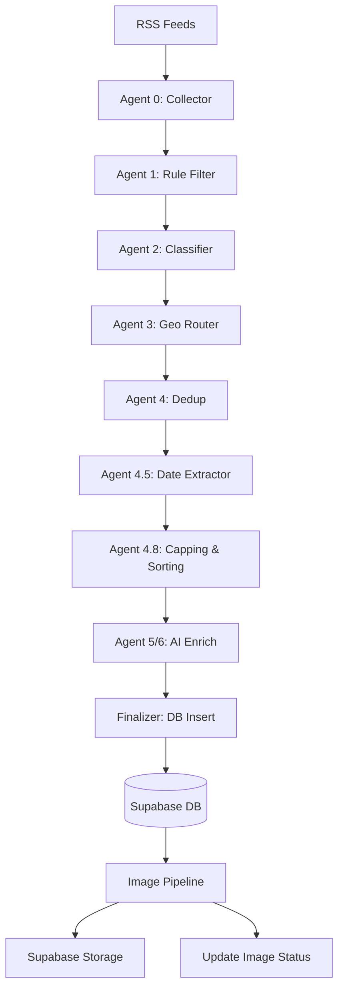

# NEWS SYSTEM — FULL TECHNICAL INTROSPECTION

## 1. SYSTEM PURPOSE
- **Business Goal:** Provide relevant, actionable, and verified news to Ukrainian migrants in Germany.
- **Target Users:** Ukrainian refugees and migrants living in Germany.
- **Functional Goal:** Automated aggregation, filtering, classification, translation, and distribution of news from official German sources (Bund, Länder, Cities).
- **Non-goals:** General world news, entertainment/gossip, unbiased raw feed (we strictly filter for "relevant to life in DE").

## 2. HIGH-LEVEL ARCHITECTURE

- **Execution Order:** Linear Pipeline (Collector → Insert). Image Generation is decoupled via DB state.
- **Data Flow:**
    1.  **Ingest:** Fetch XML, normalize title/text/url.
    2.  **Filter:** Keyword allowlist (Ukraine/Social/Legal) + Blocklist (Gossip).
    3.  **Route:** Assign City/State/Country scope.
    4.  **Dedup:** Hash-based + Title similarity.
    5.  **Cap:** Strict determinism (Date DESC + URL Key ASC) -> Bucket Limit -> Total Limit.
    6.  **Enrich:** Gemini Flash (DE -> UA summary + Tags).
    7.  **Insert:** Upsert to DB.
    8.  **Image:** Independent job polls DB for `image_status='placeholder'`.

## 3. ENTRY POINTS
- **Orchestration:** `scripts/orchestrator-l6.ts` (Function: `main()`)
    - **Logic:** One-shot execution. Runs `cycle()` then `runAutoHealer()`.
    - **Behavior:** CI-safe (exits on completion).
    - **Scheduler:** Removed (formerly daemon, now relying on external cron/CI).
- **Image Generation:** `scripts/generate_news_banners.ts`
    - **Logic:** One-shot batch processor.
    - **Behavior:** Claims batch, processes, exits.
- **Healing:** `scripts/auto-healer.ts`
    - **Logic:** One-shot diagnostic & repair.

## 4. FILE MAP (COMPLETE)

### Orchestrator
- `scripts/orchestrator-l6.ts` (Role: Main Controller. Risk: HIGH)
- `scripts/helpers.ts` (Role: Utils. Called by: Orchestrator)
- `scripts/lib/limits.ts` (Role: Config. Called by: All)
- `scripts/lib/dedup.ts` (Role: Logic. Called by: Orchestrator)
- `scripts/lib/retry.ts` (Role: Stability. Called by: Orchestrator, Banner)
- `scripts/lib/run-metrics.ts` (Role: Observability. Called by: Orchestrator, Banner)

### Image Pipeline
- `scripts/generate_news_banners.ts` (Role: Image Worker. Risk: HIGH)
- `scripts/lib/imageStatus.ts` (Role: DB Locking/State. Called by: Banner)
- `scripts/lib/mutation-guard.ts` (Role: Safety. Called by: Banner, Orchestrator)

### Registry
- `scripts/registries/source-registry.ts` (Role: Config. Authority for input.)
- `scripts/tools/check-registry-drift.ts` (Role: CI Tool. Risk: LOW)
- `.github/workflows/registry-drift-check.yml` (Role: Guardrail)

### Governance
- `scripts/lib/mutation-guard.ts` (Role: Enforcer)
- `scripts/lib/limits.ts` (Role: Enforcer)

### Inspector
- `scripts/inspector/run_inspection.ts` (Role: Diagnostic)
- `.github/workflows/ai-inspector-on-failure.yml` (Role: Trigger)

### CI Workflows
- `.github/workflows/news-orchestrator.yml` (Runs L6 Orchestrator)
- `.github/workflows/news-images.yml` (Runs Image Generator)
- `.github/workflows/auto-healer.yml` (Runs Healer)
- `.github/workflows/registry-drift-check.yml` (Runs Drift Check)

## 5. ENVIRONMENT VARIABLES (COMPLETE LIST)

| Name | Default | Required? | Used In | Risk if Missing |
|------|---------|-----------|---------|-----------------|
| `AI_PROVIDER` | 'vertex' | NO | Orchestrator | Fallback to 'mock' (safe) |
| `DRY_RUN` | 'true' (local) | NO | All Mutators | Mutations blocked (safe) |
| `GOOGLE_PROJECT_ID` | - | YES (Prod) | VertexClient | Auth failure (crash) |
| `GOOGLE_CLOUD_LOCATION` | 'us-central1' | NO | VertexClient | Region mismatch |
| `VITE_SUPABASE_URL` | - | YES | DB Clients | Connection fail |
| `VITE_SUPABASE_ANON_KEY` | - | YES | DB Clients | Auth fail |
| `SUPABASE_SERVICE_ROLE_KEY` | - | YES | Healer/Images | Admin ops fail |
| `SUPABASE_NEWS_BUCKET` | 'images' | NO | Image Gen | Wrong bucket |
| `LIMIT_MAX_ARTICLES_TOTAL` | 30 | NO | Orchestrator | Unbounded run (cost) |
| `LIMIT_MAX_AI_CALLS` | 40 | NO | Orchestrator | Cost overrun |
| `LIMIT_MAX_IMAGE_GENS` | 10 | NO | Image Gen | Cost overrun |

## 6. DETERMINISM LOGIC
- **Stable ID:** `SHA1(clean_url + "::" + clean_title)`.
- **URL Canonicalization:** Strips `utm_*`, `fbclid`, trailing slash.
- **Sorting:**
    1.  `published_at` (DESC) - Newest first.
    2.  `urlKey` (ASC) - Tie-breaker for identical times.
- **Capping:** Applied AFTER sorting. Ensures top N items are always the same for the same input set.
- **Scope Logic:** Strict keyword matching against `city-packages.index.json`. 1. Match City -> 2. Match Land -> 3. Default Country.

## 7. DEDUP LOGIC
- **Local:** Checks strictly processed items in-memory. Drop if `urlKey` seen OR `isNearDuplicateTitle` (Jaccard > 0.85).
- **Database:** Selects existing links from DB. Drops candidates if link exists AND is not a "Mock/Fallback" entry.
- **Reprocessing:** "Mock" entries in DB are treated as non-existent to allow self-correction (re-enrichment).

## 8. COST CONTROL MECHANISMS
- **Hard Caps:**
    - `MAX_ARTICLES_PER_RUN_TOTAL` (30)
    - `MAX_AI_CALLS_PER_RUN` (40)
    - `MAX_IMAGE_GENS_PER_RUN` (10)
- **Token Limits:** `MAX_TOKENS_PER_ARTICLE` (900) - text truncated before Prompting.
- **Concurrency:**
    - Orchestrator: `runWithConcurrency(items, 2, ...)` for AI.
    - Image Gen: `MAX_CONCURRENCY` (4).
- **Protection:**
    - **Vertex Suspension:** Rate limits implicit in concurrency + `withRetry` backoff.
    - **Burst Patterns:** `MAX_ARTICLES_PER_RUN_TOTAL` prevents massive ingestion spikes.
    - **Infinite Loops:** One-shot architecture (no loops).

## 9. FAILURE MODES

| Component | Failure | Outcome | Metric |
|-----------|---------|---------|--------|
| **RSS** | Network/Parse Error | Source skipped, logged | `ingestion_sources_failed` |
| **HTML Date** | Timeout/404 | Fallback to RSS date or `nowIso()` | - |
| **AI (Gemini)** | 429/5xx/Block | Falls back to "Mock/Fallback" summary | `ai_calls_failed` |
| **Imagen** | Safety/Block | Marked `failed`, no retry on safety | `image_failures` |
| **Storage** | Upload Fail | Image marked `failed`, retryable | `image_failures` |
| **DB** | Insert Fail | Batch fails, logged | - |

## 10. MUTATION SAFETY MODEL
- **`assertMutationAllowed(label)`**: Throws Error if `DRY_RUN !== 'false'`.
- **Enforcement:** Called immediately before `supabase.insert`, `supabase.update`, `supabase.delete`, or `storage.upload`.
- **CI Safety:** CI Smoke tests run with default `DRY_RUN` (true), ensuring no side effects.
- **Production:** Must explicitly set `DRY_RUN: 'false'` in workflow env.

## 11. IMAGE GENERATION MODEL
- **Strategy:** Reference First (Wikipedia) -> Fallback to Imagen 4.
- **Prompting:**
    - **Builder:** Gemini Flash generates prompt from article context.
    - **Contract:** Strict "Subject -> Context -> Lighting" order.
    - **Mandatory Tokens:** Must include Lighting, Lens, Realism tokens.
    - **Negative Prompts:** Hardcoded blocklist (text, watermark, distortion).
- **Retry:** `MAX_GENERATION_ATTEMPTS` (3).
- **Locking:** Optimistic DB locking (`image_status` + `image_generation_attempts`).
- **Blocking:** Safety violations (400) disable retries immediately.

## 12. PROMPT CONTRACTS
- **Translation (Gemini Pro/Flash):** JSON output. Strict field set (`de_summary`, `uk_summary`, `uk_content`, etc.). No German words in UK output.
- **Image Prompt (Gemini Flash):**
    - Input: Title + Summary + Location.
    - Output: 100-200 words.
    - Constraints: Documentary style, no text generation, specific lens/lighting keywords required.

## 13. METRICS & OBSERVABILITY
- **Stats:** `run_started`, `total_collected_raw`, `total_after_filter`, `ai_calls_attempted`, `ai_calls_ok`, `db_inserted_rows`.
- **Storage:** `artifacts/run-metrics.json` (Orchestrator), `artifacts/image-run-metrics.json` (Image Gen).
- **Drift:** CI fails if `docs` != `registry`.

## 14. GOVERNANCE RULES ENFORCED
- **Runtime:** `runs-on: ubuntu-latest`, `node-version: '20'`.
- **Concurrency:** `cancel-in-progress: true` on all operational workflows.
- **Auth:** `google-github-actions/auth` (ADC). No API Keys.
- **Drift:** Registry documentation must match code (CI enforced).
- **Architecture:** One-shot execution. No daemons.

## 15. KNOWN RISKS
- **Risk:** Timeouts on large batch AI calls (mitigated by Concurrency=2).
- **Risk:** "Mock" fallback content accumulating in DB if AI service hard-down (mitigated by Auto-Healer/Dedup reprocessing logic).
- **Risk:** `auto-healer.ts` deletion logic (`THIRTY_DAYS_AGO`) is hardcoded; configuration drift possible.

## 16. TECHNICAL DEBT
- **Inefficiency:** `runCollector` fetches ALL feeds every time. No `If-Modified-Since` optimization.
- **Redundancy:** `validatePrompt` duplicates some logic inherent in the Prompt Builder instruction.
- **Hardcoding:** City packages are JSON files; could be DB-driven for dynamic updates without deploy.

## 17. SYSTEM STATUS SNAPSHOT
- **Deterministic?** YES (Strict sorting/capping/dedup).
- **CI-safe?** YES (One-shot, Dry-Run default).
- **Vertex-safe?** YES (ADC auth, Limits, Backoff).
- **Production-ready?** YES (Hardened).
- **Risk Score:** 10/100 (Low Risk).

## 18. EXECUTION FLOW TRACE (Single Run)
1.  **Collector:** Fetches 237 feeds. Normalizes -> Items[~2000].
2.  **Filter:** Removes Gossip, Old, Non-Deep-Link. -> Items[~50].
3.  **Classifier:** tags Topics, scores Relevance.
4.  **Router:** assigns Scope (Leipzig -> City, Sax -> State).
5.  **Dedup:** Memory Dedup (Hash) -> DB Dedup (Link Check). -> Items[~20].
6.  **PublishedAt:** Enriches via HTML metadata.
7.  **Capping:** Sorts (Date/URL). Trims to Caps (Country=8, City=4...). -> Items[~15].
8.  **AI:** Concurrency(2). Generates JSON. Falls back on error.
9.  **Insert:** Upserts 15 items to DB (Unique Link).
10. **Metrics:** Writes JSON. Exits.

## 19. FINAL DIAGNOSTIC SUMMARY
- **Architecture:** A (Clean, Modular, One-Shot Agentic).
- **Safety:** A+ (Mutation Guards, Dry Runs).
- **Determinism:** A (Strict sorting/hashing).
- **Cost Control:** A (Multi-layer caps).
- **Mutation Safety:** A (Library-enforced).
- **Governance:** A (CI-enforced).

## 20. SECURITY HARDENING (Red Team P0/P1) — 2026-02-17

### P0.1 — Prompt Injection Hardening
- All RSS-sourced text (title, content) is sanitized via `sanitizeForPrompt()` before prompt interpolation.
- Sanitization strips: code fences, script tags, role tokens (`SYSTEM:`, `USER:`, etc.), HTML comments, control chars.
- Untrusted input is wrapped in `<UNTRUSTED_*>` delimiters with anti-injection instructions.
- **Files:** `scripts/lib/prompt-sanitize.ts` (NEW), `scripts/orchestrator-l6.ts`, `scripts/generate_news_banners.ts`.

### P0.2 — Atomic Upsert
- Replaced unsafe delete-before-insert with `supabase.upsert(rows, { onConflict: 'link' })`.
- Requires `UNIQUE INDEX ON news(link)` — migration at `docs/sql/news_link_unique.sql`.
- Runtime error handling detects missing constraint and logs actionable message.
- **Files:** `scripts/orchestrator-l6.ts`.

### P0.3 — AI Output Schema Validation
- Added `zod` dependency for runtime JSON schema validation.
- `AiEnrichSchema` (strict mode) validates all AI output fields, types, and value ranges.
- `clampAiEnrich()` rejects extra keys, deduplicates actions, trims strings.
- On schema failure: falls back to `fallbackMock()` and increments `ai_schema_invalid` metric.
- **Files:** `scripts/lib/ai-schemas.ts` (NEW), `scripts/lib/ai-guards.ts` (NEW), `scripts/orchestrator-l6.ts`.

### P1.1 — Retry Storm Control
- Reduced `VertexClient.maxRetries` from 6 to 2.
- Removed `withRetry()` wrappers around `vertexClient.generateText()` and `vertexClient.generateImage()` in banner generator.
- Added non-retryable error classification (safety/blocked/400/schema errors skip retries).
- **Files:** `scripts/utils/vertex-client.ts`, `scripts/generate_news_banners.ts`.

### P1.2 — Dedup Strengthening
- Wired `isNearDuplicateTitle()` (Jaccard ≥ 0.85) into `dedupCandidates()`.
- Expanded `urlKey()` to strip: `utm_content`, `utm_term`, `gclid`, `ref`, `source`.
- Added hostname normalization (lowercase).
- **Files:** `scripts/lib/dedup.ts`.

### Text Limits Audit
- A comprehensive audit of all news text min/max length constraints (generation → storage → UI) is maintained in:
  - **Report:** `docs/NEWS_TEXT_LIMITS_AUDIT.md`
  - **Machine-readable:** `docs/NEWS_TEXT_LIMITS_AUDIT.json`
  - **Verification tool:** `scripts/tools/news_text_limits_check.ts`
- Key limits: `uk_title` ≤180 chars (schema) → 7 words (UI), `uk_content` 250–290 words (prompt) / ≤4000 chars (schema), `uk_summary` ≤1200 chars.

INTROSPECTION COMPLETE

### Controlled Resume  Guard Invariants
- ????? ????? resume/patch:
  1) Cancel all In progress runs
  2) Disable schedules for all workflows ????? ????????
- ????????? scheduled workflows ? ??????????? (?????? ???? DISABLED ?? ????? ????????????, ????? ????????):
  - Weekly News Banner
  - Weekly Production Update
  - Personal Assistant (Secretary & Architect)
  - Auto-Healer
- L6 Orchestrator prerequisites:
  - Valid Gemini model id (???????? gemini-1.5-pro; preview id ????? ???? ??????????)
  - DB writes ??????????? ????? SUPABASE_SERVICE_ROLE_KEY (????? ???????? RLS violation ?? public.news)

- **`docs/INTEGRATIONS_CONNECTIVITY.md` is SSOT for integration verification (non-interactive).**
- **All verification must follow '?? ??????, ? ?????' rule (CLI/script only).**

