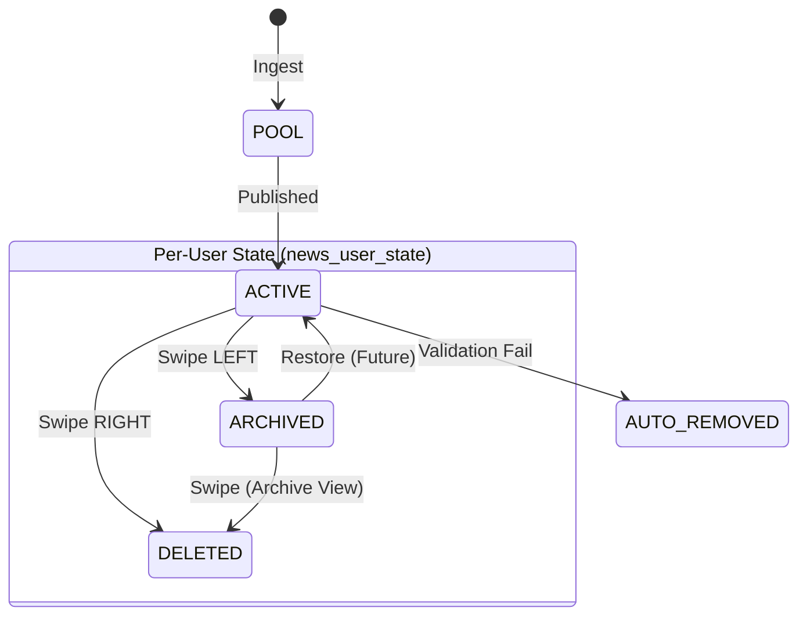

# STATE MACHINE GOVERNANCE

**Status:** ACTIVE
**Version:** 2.0 (CR-008 Implemented)
**Related:** `src/types/index.ts`, `supabase/migrations/20260219153000_create_news_user_state.sql`

---

## 1. System States

The system defines states in `NewsStatus` (TypeScript) and `user_news_status` (DB Enum).

| State | Scope | Persistence | Description |
|-------|-------|-------------|-------------|
| **POOL** | Global | `news.status` | Ingested, awaiting processing. |
| **ACTIVE** | Global | `news.status` | Published to feed. |
| **ARCHIVED** | User | `news_user_state` | User saved item. Removed from Feed, visible in Archive. |
| **DELETED** | User | `news_user_state` | User removed item. Hidden from all views. |
| **AUTO_REMOVED** | Global | `news.status` | System removed (broken link/content). |
| **SHADOW_DELETED** | Global | `news.status` | Admin soft-delete. |

---

## 2. State Transition Diagram

## 3. Transition Rules

### 3.1 Global Server Transitions
| From | To | Trigger | Code Path |
|------|----|---------|-----------|
| POOL | ACTIVE | Image Generation | `generate_news_banners.ts` |
| ACTIVE | AUTO_REMOVED | Auto-Healer | `auto-healer.ts` |

### 3.2 Per-User Transitions
| From | To | Trigger | Code Persistence |
|------|----|---------|------------------|
| ACTIVE | ARCHIVED | Swipe LEFT (Feed) | `upsert(status='ARCHIVED')` |
| ACTIVE | DELETED | Swipe RIGHT (Feed) | `upsert(status='DELETED')` |
| ARCHIVED | DELETED | Swipe LEFT/RIGHT | `update(status='DELETED')` |

## 4. Complexity & Persistence
- **Table:** `news_user_state` (user_id, news_id, status)
- **Constraint:** `UNIQUE(user_id, news_id)` ensures one state per user per item.
- **Querying:**
  - **Feed:** Fetch `news` WHERE id NOT IN (SELECT news_id FROM news_user_state WHERE user_id=me)
  - **Archive:** Fetch `news` JOIN news_user_state WHERE status='ARCHIVED' AND user_id=me

## 5. Deprecations
- **LocalStorage (`history.archived`, `history.deleted`)** is now an **optimistic cache only**, not the source of truth.
- **`user_news_states` table** (blob storage) is deprecated for archive/delete tracking.
