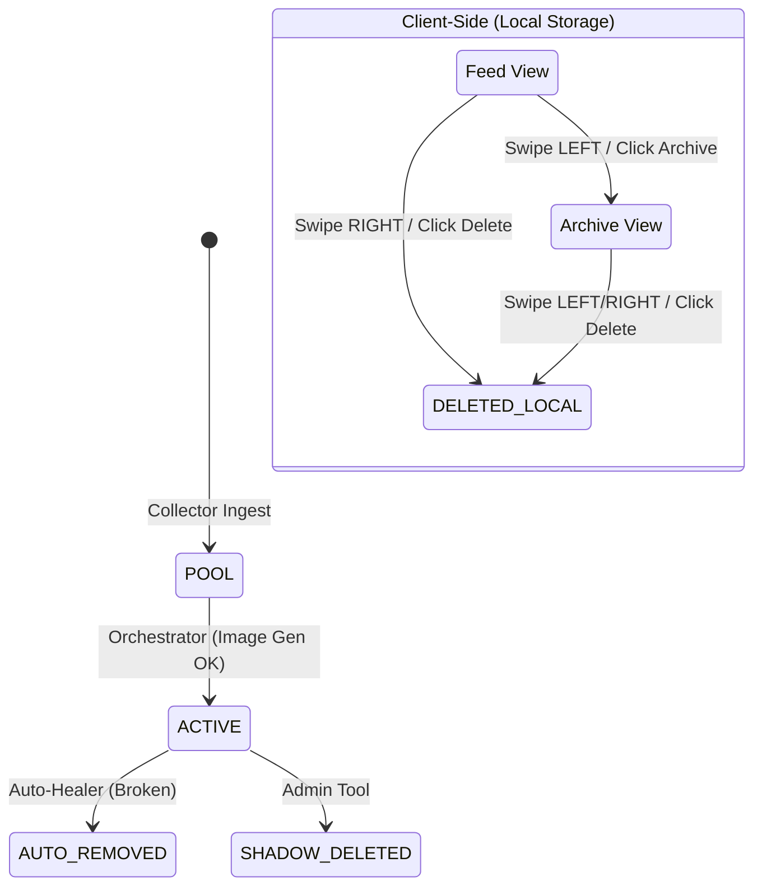

# STATE MACHINE GOVERNANCE

**Status:** Draft (As-Is Snapshot)
**Version:** 1.0
**Related:** `src/types/index.ts` (NewsStatus)

---

## 1. System States

The system defines 7 states in `NewsStatus`, but currently operates on a split dual-state model (DB-side vs Client-side).

| State | Scope | Description |
|-------|-------|-------------|
| **POOL** | DB | Ingested by collector, awaiting processing/enrichment. Not visible to users. |
| **ACTIVE** | DB | Published, enriched, and serving to users. |
| **ARCHIVED** | Local* | User has swiped LEFT or clicked "Archive". *Stored in localStorage, DB status remains ACTIVE.* |
| **DELETED** | Local* | User has swiped RIGHT or clicked "Delete". *Stored in localStorage, DB status remains ACTIVE.* |
| **AUTO_REMOVED** | DB | Removed by `auto-healer` (e.g. broken link). |
| **SHADOW_DELETED** | DB | Soft-deleted by admin/system. |
| **AUTO_EXPIRED** | DB | TTL expired (not currently enforced). |

> [!WARNING]
> **Split Brain Risk:** `ARCHIVED` and `DELETED` are strictly client-side states in the current implementation. The DB `status` column DOES NOT reflect these user actions.

---

## 2. State Transition Diagram

## 3. Transition Rules

### 3.1 Server-Side Transitions
| From | To | Trigger | Code Path |
|------|----|---------|-----------|
| (Null) | POOL | Collector insert | `orchestrator-l6.ts` |
| POOL | ACTIVE | Image generated | `generate_news_banners.ts` |
| ACTIVE | AUTO_REMOVED | Validation failure | `auto-healer.ts` |

### 3.2 Client-Side Transitions
| From | To | Trigger | Code Path |
|------|----|---------|-----------|
| ACTIVE | ARCHIVED | Swipe LEFT (Feed) | `FeedManager.handleSwipe('LEFT')` |
| ACTIVE | DELETED | Swipe RIGHT (Feed) | `FeedManager.handleSwipe('RIGHT')` |
| ARCHIVED | DELETED | Swipe LEFT/RIGHT (Archive) | `FeedManager.handleArchiveDeletion()` |

> [!CAUTION]
> **No Restore Path:** There is currently no UI or logic to move an item from DELETED back to ARCHIVED or ACTIVE. Deletion is destructive to the local view state.

## 4. Persistence Model

- **DB (`news` table):** Stores `POOL`, `ACTIVE`, `AUTO_REMOVED`.
- **LocalStorage (`telegram-app-news-state-v7`):** Stores list of `archived[]` and `deleted[]` IDs.
- **Cloud Sync (`user_news_states`):** Backs up the localStorage blob, but does NOT reconcile with `news.status`.

## 5. Future Harmonization (Correction Roadmap)

To reach full SSOT, the system must:
1. Write `ARCHIVED` and `DELETED` status to the DB on user action (CR-008).
2. Filter the Feed query to exclude `ARCHIVED` items server-side.
3. Implement `RESTORE` transition (Deleted → Archived).
