# WORKFLOW SCHEME — Navestic / Antigravity Operations

**Status:** ACTIVE  
**Version:** 1.0  
**Date:** 2026-02-20  

---

## Purpose

This document defines the end-to-end operational workflow connecting all actors, tools, and systems in the Navestic project. It serves as the canonical reference for how tasks flow from human intent to deterministic execution and evidence capture.

---

## Actors & Tools

| Actor | Role | Environment |
|---|---|---|
| **David** | Human operator, decision-maker, final approval | Local machine (Windows) |
| **ChatGPT 5.2** | Orchestrator — produces AG TASK FILE directives | Chat interface |
| **Antigravity Chat** | Execution channel — receives AG TASK FILEs and routes to AG Agent | IDE-integrated agent |
| **AG Agent** | Executor — reads/writes code, runs CLI, executes scripts | Local machine (PowerShell) |
| **GitHub / Actions** | Version control, CI/CD runners, workflow automation | GitHub Cloud |
| **Firebase Hosting** | Static frontend hosting (SPA) | GCP project `top-cascade-485612-c6` |
| **Supabase** | Database (PostgreSQL), Auth, Storage, Edge Functions | Supabase Cloud |
| **Vertex AI** | AI model inference (Gemini) | GCP project `claude-vertex-prod` |

### GCP Project Topology

| GCP Project | Services |
|---|---|
| `top-cascade-485612-c6` | Firebase Hosting, Infrastructure (Terraform) |
| `claude-vertex-prod` | Vertex AI (Gemini models), Cloud services (NEEDS CONFIRMATION: Verify if separate or same as Firebase) |

### Supabase Edge Functions

| Function | Purpose |
|---|---|
| `serve-feed` | Serves news feed to frontend clients |
| `status` | Health/status endpoint |

---

## Deterministic Rules

### НЕ СМОТРИ, А ЧИТАЙ (Don't Look, Read)

- **FORBIDDEN:** Browser/UI visual verification for correctness.
- **ALLOWED:** CLI outputs, file diffs, SQL results, commit SHAs, workflow run IDs.

### Mutation Guard Discipline

1. Before any mutation: run `npx tsx scripts/ops/preflight_mutation.ts`
2. Confirm **0 runs in-progress** via `gh run list --status in_progress`
3. Confirm scheduled workflows are paused (except allowlist)
4. **One change = one goal = one test**
5. Micro-commits with deterministic acceptance tests

---

## End-to-End Flow (Step-by-step)

1. **David** identifies a need (bug, feature, investigation)
2. **David** selects **Model Decision** (ANALYST vs EXECUTOR) per `docs/OPS_MODEL_DECISION_MATRIX.md`
3. **David** fills **Entry Template** (`docs/OPS_ENTRY_TEMPLATE.md`) or uses generator:
   `npx tsx scripts/ops/new_task.ts --title "..." --type SAFE_PATCH --goal "..."`
4. **ChatGPT 5.2** receives context and produces a structured **AG TASK FILE**
5. **David** pastes AG TASK FILE into **Antigravity Chat**
6. **AG Agent** executes:
   - Runs **Preflight** (`scripts/ops/preflight_mutation.ts`)
   - Applies changes (code edits, SQL, scripts)
   - Runs acceptance tests (CLI, grep, SQL)
   - Micro-commits with descriptive messages
7. **AG Agent** generates **Evidence Pack**:
   `npx tsx scripts/ops/write_evidence_pack.ts --title "..." --scope "..."`
8. **AG Agent** pushes to GitHub → triggers CI (Governance Guard, CI Smoke Test)
9. **AG Agent** reports back to **Antigravity Chat** with:
   - Commit SHAs
   - CLI/SQL proof outputs
   - Evidence pack file path
10. **David** reviews evidence and decides: **GO / NO-GO**
11. If **GO**: merge to main → Firebase deploy (auto via workflow) + Supabase migrations (manual or CI)
12. **David** feeds evidence summary back to **ChatGPT 5.2** for context continuity

---

## Diagram (Mermaid)

```mermaid
flowchart TB
    David["👤 David<br/>(Human Operator)"]
    ChatGPT["🤖 ChatGPT 5.2<br/>(Orchestrator)"]
    AGChat["💬 Antigravity Chat<br/>(Execution Channel)"]
    AGAgent["⚙️ AG Agent<br/>(Executor)"]

    subgraph LocalMachine["🖥️ Local Machine (Windows)"]
        AGAgent
        Preflight["🛡️ Preflight Check"]
        EvidencePack["📋 Evidence Pack"]
        Scripts["📂 scripts/ops/*"]
    end

    subgraph GitHub["🐙 GitHub"]
        Repo["📦 Repository"]
        Actions["🔄 GitHub Actions"]
        GovGuard["🏛️ Governance Guard"]
        CISmoke["🧪 CI Smoke Test"]
        L6Orch["⏰ L6 Orchestrator<br/>(hourly cron)"]
    end

    subgraph GCP_Firebase["☁️ GCP: top-cascade-485612-c6"]
        Firebase["🔥 Firebase Hosting<br/>(SPA dist/)"]
    end

    subgraph GCP_Vertex["☁️ GCP: claude-vertex-prod (NEEDS CONFIRMATION)"]
        Vertex["🧠 Vertex AI<br/>(Gemini Models)"]
    end

    subgraph Supabase["🟢 Supabase"]
        DB["🗄️ PostgreSQL"]
        Auth["🔐 Auth"]
        Storage["📁 Storage Buckets"]
        EdgeFn["⚡ Edge Functions<br/>(serve-feed, status)"]
    end

    David -->|"1. Context + Model Decision"| ChatGPT
    ChatGPT -->|"2. AG TASK FILE"| David
    David -->|"3. Paste Task"| AGChat
    AGChat -->|"4. Execute"| AGAgent
    AGAgent -->|"5. Preflight"| Preflight
    AGAgent -->|"6. Code + SQL"| Repo
    AGAgent -->|"7. Evidence"| EvidencePack
    Repo -->|"8. Push"| Actions
    Actions --> GovGuard
    Actions --> CISmoke
    Actions -->|"Deploy"| Firebase
    L6Orch -->|"Hourly"| Vertex
    L6Orch -->|"Write news"| DB
    Vertex -->|"AI Enrichment"| L6Orch
    AGAgent -->|"SQL/RPC"| DB
    AGAgent -->|"gh CLI"| Actions
    EdgeFn -->|"Query"| DB
    Firebase -->|"API calls"| EdgeFn
    AGAgent -->|"9. Report"| AGChat
    AGChat -->|"10. Evidence"| David
    David -->|"11. Feed back"| ChatGPT
```



---

## Diagram (ASCII)

```
┌─────────────────────────────────────────────────────────────────────────┐
│                        WORKFLOW SCHEME (Navestic)                        │
└─────────────────────────────────────────────────────────────────────────┘

  👤 David ──────────► 🤖 ChatGPT 5.2 ──────────► AG TASK FILE
      │                       ▲                         │
      │                       │ (11. Evidence            │
      │                       │   feedback)              │
      │                       │                          ▼
      │                  10. Review ◄──── 💬 Antigravity Chat
      │                                        │
      │                                        ▼
      │                              ⚙️ AG Agent (Local)
      │                              ┌─────────────────┐
      │                              │ 5. Preflight ✅  │
      │                              │ 6. Code + SQL    │
      │                              │ 7. Evidence Pack │
      │                              └───────┬─────────┘
      │                                      │
      │                           8. git push │
      │                                      ▼
      │                    ┌──────────────────────────────┐
      │                    │      🐙 GitHub / Actions      │
      │                    │  ┌────────┐  ┌─────────────┐ │
      │                    │  │Gov Guard│  │CI Smoke Test│ │
      │                    │  └────────┘  └─────────────┘ │
      │                    │  ┌──────────────────────────┐ │
      │                    │  │ L6 Orchestrator (hourly) │ │
      │                    │  └───────────┬──────────────┘ │
      │                    └──────────────┼────────────────┘
      │                       Deploy │    │ AI Enrich
      │                              ▼    ▼
      │          ┌──────────────┐  ┌──────────────────┐
      │          │ 🔥 Firebase   │  │ 🧠 Vertex AI      │
      │          │ Hosting (SPA) │  │ (Gemini Models)  │
      │          │ top-cascade.. │  │ claude-vertex-.. │
      │          └───────┬──────┘  └──────────────────┘
      │                  │ API
      │                  ▼
      │          ┌──────────────────────────────┐
      │          │       🟢 Supabase             │
      │          │  ┌────────┐ ┌──────────────┐ │
      │          │  │  DB    │ │Edge Functions │ │
      │          │  │(news,  │ │(serve-feed,  │ │
      │          │  │ state) │ │ status)      │ │
      │          │  └────────┘ └──────────────┘ │
      │          │  ┌────────┐ ┌──────────────┐ │
      │          │  │  Auth  │ │   Storage    │ │
      │          │  └────────┘ └──────────────┘ │
      │          └──────────────────────────────┘
      │
      └──────── GO / NO-GO Decision ────────────►
```

---

## Evidence & Audit Trail

All tasks must produce deterministic proof per `docs/OPS_EVIDENCE_STANDARD.md`:

| Proof Type | What | Format |
|---|---|---|
| **Deploy** | Commit SHA + Workflow Run ID | `artifacts/<date>_evidence.md` |
| **DB Mutation** | SQL output (SELECT before + after) | Inline in evidence pack |
| **Workflow Control** | `gh run list` / `gh workflow list` output | CLI capture |
| **Model Switch** | git diff showing config change | Commit SHA |

Evidence is generated via: `npx tsx scripts/ops/write_evidence_pack.ts --title "..." --scope "..."`

---

## Common Task Types

| Type | Description | Model | Mutations |
|---|---|---|---|
| **SAFE PATCH** | Small, reversible code/data change | EXECUTOR | Yes (guarded) |
| **INVESTIGATION** | Read-only deep dive, root cause analysis | ANALYST | No |
| **DEEP** | Large architectural change, multi-phase | ANALYST → EXECUTOR | Yes (phased) |

---

## Model Selection Protocol

Per `docs/OPS_MODEL_DECISION_MATRIX.md`:

| Role | Use Case | Example Models |
|---|---|---|
| **ANALYST** | Reasoning, planning, investigation | Claude Thinking |
| **EXECUTOR** | Implementation, scripts, mutations | Gemini 3.1 Pro High |
| **FAST** | Quick lookups, simple diffs | Gemini Flash |

**Rule:** Mixed tasks = 2 separate AG TASK FILEs (ANALYST first, then EXECUTOR).

David selects the model in the Antigravity Chat model picker before pasting the AG TASK FILE.

---

## Commands Quickstart

```bash
# Generate a new AG TASK FILE skeleton
npx tsx scripts/ops/new_task.ts --title "My Task" --type SAFE_PATCH --goal "Fix X"

# Run preflight mutation check (MANDATORY before any mutation)
npx tsx scripts/ops/preflight_mutation.ts

# Generate evidence pack after task completion
npx tsx scripts/ops/write_evidence_pack.ts --title "My Task" --scope "Changed Y" --notes "Success"
```

---

## Verified Facts Table

| Fact | Value | Source |
|---|---|---|
| Firebase type | Hosting + Functions | `firebase.json` — only `hosting` key |
| GCP project (Firebase) | `top-cascade-485612-c6` | `.firebaserc` |
| GCP project (Vertex) | `claude-vertex-prod` (NEEDS CONFIRMATION) | `auto-healer.yml` L37 hardcoded |
| serve-feed type | Supabase Edge Function | `supabase/functions/serve-feed/index.ts` |
| Edge Functions count | 2: `serve-feed`, `status` | `supabase/functions/` listing |
| Active schedule | L6 Orchestrator only (`0 * * * *`) | `news-orchestrator.yml` L5 |
| All other schedules | Commented out in YAML | grep across `.github/workflows/` |
| GCP auth (CI) | `google-github-actions/auth@v2` + SA JSON | All 9 workflow files |
| GCP auth (local) | ADC via `GOOGLE_CREDENTIALS` env | `.env` |
| Supabase auth (local) | `SERVICE_ROLE_KEY` + `ACCESS_TOKEN` | `.env` (verified write+SQL) |
| GitHub auth (local) | `GITHUB_TOKEN` env var (scope: `repo`) | `gh auth status` |
| Node version (CI) | 20 (all workflows aligned) | grep `node-version` across YAMLs |
| Node version (local) | v24.13.0 | `node --version` |
| Toolchain | npm 11.6.2, gh 2.87.0, firebase 15.5.1, supabase 2.75.0, gcloud 554.0.0 | CLI version checks |
